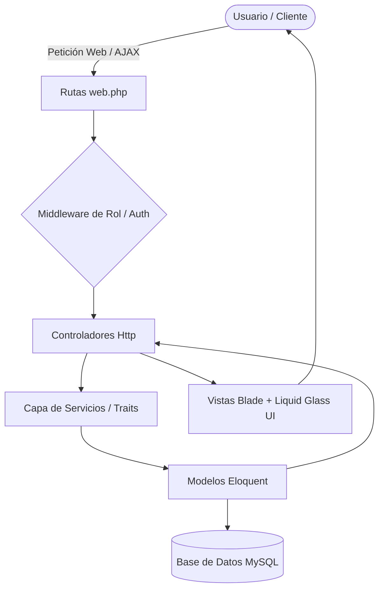
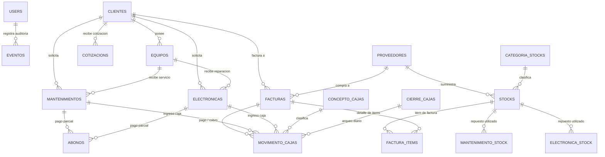
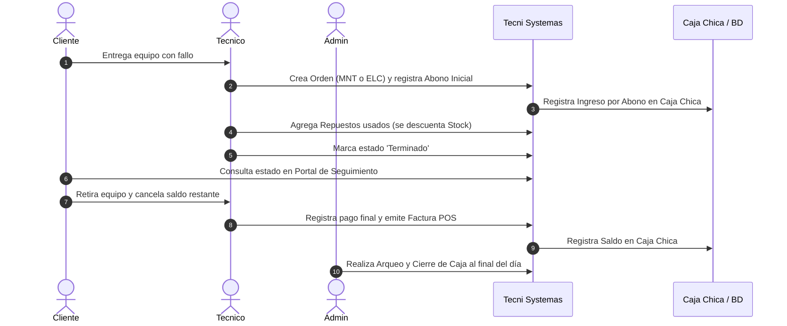

# 📘 CUADERNO 2: MANUAL DE ARQUITECTURA Y LÓGICA DE NEGOCIO
## Explicación Exhaustiva, Modular y de Fácil Comprensión
## Proyecto: TECNI SYSTEMAS - Sistema de Control de Mantenimiento y Gestión Empresarial

---

## 🏛️ 1. Explicación Sencilla de la Arquitectura (MVC + Capa de Servicios)

El sistema está estructurado bajo el estándar **MVC (Modelo - Vista - Controlador)** potenciado con una **Capa de Servicios (Service Layer)** y **Traits Reutilizables**:

1. **La Vista (View)**: 
   - Diseñada bajo la filosofía **Liquid Glass (Glassmorphism)**, proporcionando interfaces translúcidas, adaptables (responsive) con modo oscuro dinámico (`☀️ / 🌙`).
   - Integración de modales asíncronos (`ts-modal`) para confirmaciones elegantes sin recargas de pantalla ni pantallas emergentes nativas del navegador.
2. **El Controlador (Controller)**:
   - Valida datos de entrada (prevención de inyecciones SQL y caracteres inválidos), gestiona respuestas JSON para peticiones asíncronas y renderiza vistas.
3. **La Capa de Servicios y Traits (Services / Traits)**:
   - `StockService`: Centraliza movimientos atómicos de stock con bloqueos transaccionales `lockForUpdate()` para prevenir sobre-ventas.
   - `AnulacionService`: Maneja de forma unificada la anulación lógica y reversión de inventario/caja con confirmación de clave de administrador.
   - `HandlesAbono` y `HandlesStockAttach`: Unifican el comportamiento de abonos y asignación de repuestos en Mantenimientos y Electrónica.
   - `ColombiaHelper`: Normaliza y formatea valores monetarios colombianos con puntos de mil (`$ 1.500.000,00`) y cataloga departamentos y municipios de Colombia sin peticiones lentas.
4. **El Modelo (Model)**:
   - 19 Modelos Eloquent con relaciones fuertemente tipadas, protección de asignación masiva (`$fillable`) y eventos auditables automáticos (`Auditable.php`).

---

## 📊 2. Mapa Completo de la Base de Datos y Relaciones

---

## 💰 3. Lógica Financiera, Matemática y Manejo de Dinero Real

El sistema está diseñado para operar con dinero real sin riesgo de descuadre contable:

### A. Cálculo y Consistencia de Facturas
$$\text{Total Factura} = \sum_{i=1}^{n} (\text{Cantidad}_i \times \text{Precio Unitario}_i)$$
$$\text{Saldo Pendiente} = \text{Total Factura} - \text{Total Pagado}$$
* Si $\text{Total Pagado} = \text{Total Factura} \implies \text{Estado: Emitida (Totalmente Pagada)}$.
* Si $\text{Total Pagado} < \text{Total Factura} \implies \text{Estado: Pendiente de Pago (Con Saldo)}$.
* Se bloquea cualquier intento de ingresar un pago o abono superior al saldo pendiente.

### B. Fórmula de Rentabilidad y Precios de Inventario
En el módulo de repuestos / inventario, al registrar el **Precio de Compra** y el porcentaje de **Utilidad deseada**, el sistema calcula:
$$\text{Precio Venta Público} = \text{Precio Compra} \times \left(1 + \frac{\text{Utilidad}}{100}\right)$$
$$\text{Precio Especial Técnico} = \text{Precio Compra} \times \left(1 + \frac{\text{Utilidad}}{200}\right)$$

### C. Mantenimientos y Electrónica: Desglose Claro de Costos
$$\text{Total Orden} = \text{Valor Servicio (Mano de Obra)} + \sum (\text{Costo Repuestos})$$
$$\text{Saldo a Pagar} = \text{Total Orden} - \sum (\text{Abonos Realizados})$$
* En el **Portal de Clientes/Invitados**, el usuario puede ver con total transparencia cuánto corresponde al valor del servicio y cuánto a los repuestos instalados.

### D. Arqueo y Cierre Diario de Caja Chica
$$\text{Saldo Final Sistema} = \text{Saldo Inicial} + \sum \text{Ingresos Activos} - \sum \text{Egresos Activos}$$
$$\text{Diferencia de Caja} = \text{Saldo Real Reportado} - \text{Saldo Final Sistema}$$
* Los movimientos anulados quedan excluidos automáticamente del arqueo pero conservan su trazabilidad en auditoría.

---

## 🔄 4. Flujo Operativo Integral de la Empresa

---

## 🔒 5. Seguridad y Auditoría de Acciones
1. **RBAC Estricto**: Rutas y acciones críticas restringidas por rol mediante middleware.
2. **Anulación Lógica**: Cero destrucción física de datos contables; todo registro cancelado queda marcado como anulado y genera un evento en la tabla `eventos`.
3. **Confirmación con Clave de Administrador**: Operaciones de alto riesgo (anulaciones de compras, ventas o servicios) exigen confirmación mediante la clave del Administrador.
