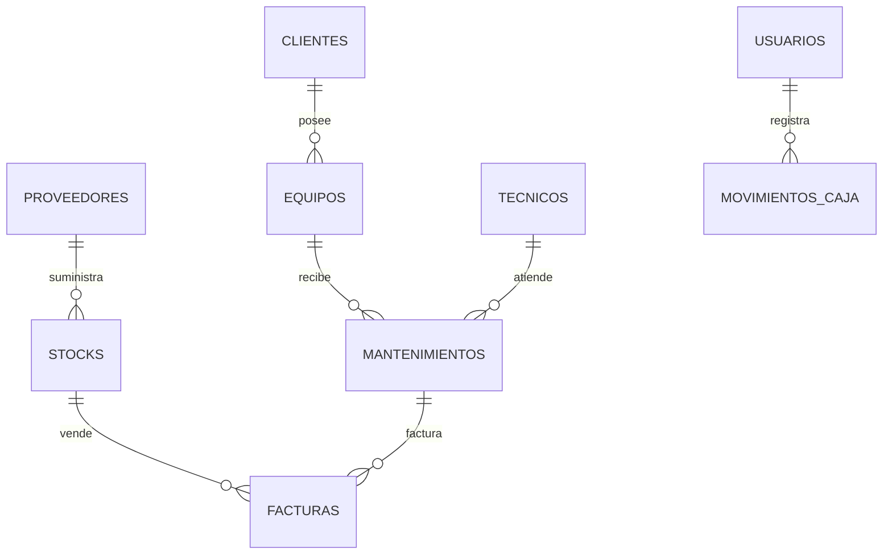

# 📘 CUADERNO 2: MANUAL DE ARQUITECTURA Y LÓGICA DE NEGOCIO
## Explicación Exhaustiva en Lenguaje Claro y Estructurado
## Proyecto: Sistema de Control de Mantenimiento de Equipos

---

## 1. EXPLICACIÓN SENCILLA DEL ARQUITECTURA (MODELO - VISTA - CONTROLADOR)

Imagina que el sistema es un **Restaurante de Alta Tecnología**:

1. **La Vista (View - Lo que el usuario ve)**:
   - Es el **Menú y el Comedor**. Son los archivos `.blade.php` que contienen los botones, formularios de registro, tablas con efecto de cristal (*Glassmorphism*) y colores.
   - En este proyecto, las vistas se diseñaron con un estilo uniforme donde cada módulo (`Clientes`, `Técnicos`, `Equipos`, `Mantenimientos`, `Electrónica`, `Stock`, `Facturas`) luce simétrico y adaptable a teléfonos y computadores.

2. **El Controlador (Controller - El Mesero y el Chef)**:
   - Es el **Cerebro operativo**. Son los archivos en `app/Http/Controllers/`.
   - Cuando un usuario presiona "Guardar Cliente", el controlador valida que la cédula no esté vacía, verifica que el teléfono sea válido y le ordena a la base de datos que guarde la información.

3. **El Modelo (Model - la Despensa y el Archivo Central)**:
   - Es la **Representación de la información**. Son los archivos en `app/Models/`.
   - Cada tabla de la base de datos tiene su modelo correspondiente (`Cliente.php`, `Equipo.php`, `Mantenimiento.php`, `Stock.php`, `MovimientoCaja.php`). Define las reglas de relación (por ejemplo: *"Un cliente puede tener muchos equipos"*).

---

## 2. MAPA DE LA BASE DE DATOS Y RELACIONES PRINCIPALES

### Relaciones Clave del Sistema:
1. **Cliente ➔ Equipos (1 a Muchos)**: Un cliente registra una o más computadoras o dispositivos.
2. **Equipo ➔ Mantenimientos (1 a Muchos)**: A un mismo equipo se le pueden realizar varios servicios a lo largo del tiempo, conservando su historial clínico técnico.
3. **Técnico ➔ Mantenimientos**: Asignación de responsabilidad para saber quién reparó cada máquina.
4. **Caja Chica ➔ Movimientos**: Registro automático de ingresos cada vez que se factura una reparación o venta de repuesto.

---

## 3. LÓGICA DE NEGOCIO Y REGLAS CLAVE

### A. Tipos de Clientes y Clasificación de Tarifas
- **Cliente Normal**: Aplica el precio de venta público estándar.
- **Cliente Técnico**: Aliado comercial o taller externo. El sistema detecta su tipo y aplica automáticamente la tarifa reducida **Precio Técnico** en la venta de insumos y repuestos.

### B. Fórmula Automática de Precios e Inventario
En el módulo de Stock (`resources/views/stocks/_form.blade.php`), al ingresar el **Precio de Compra** y el porcentaje de **Utilidad**, el sistema calcula de forma instantánea:
$$\text{Precio Venta} = \text{Precio Compra} \times \left(1 + \frac{\text{Utilidad}}{100}\right)$$
$$\text{Precio Técnico} = \text{Precio Compra} \times \left(1 + \frac{\text{Utilidad}}{200}\right)$$

### C. Estados de Órdenes de Mantenimiento
- **`⏳ Pendiente`**: El equipo ingresa a diagnóstico o taller.
- **`✅ Terminado`**: El servicio concluyó. Se habilita la asignación de fecha de salida y la emisión de la factura de cobro.

### D. Seguridad Financiera: Anulación Lógica (Soft Delete)
El sistema **jamás borra registros contables de la base de datos**. Si una orden o factura se cancela, pasa a estado `anulado = true` y exige la contraseña del Administrador. Esto evita desfalcos y garantiza auditoría total.

---

## 4. GUÍA PASO A PASO PARA UNA EMPRESA DESDE CERO

1. **Configurar Usuarios**:
   - Crear cuentas para los administradores y técnicos de la empresa.
2. **Registrar Clientes y Proveedores**:
   - Ingresar el directorio de clientes clasificándolos en *Normal* o *Técnico*.
3. **Cargar Inventario Inicial**:
   - Registrar repuestos (pantallas, discos, memorias, tarjetas) con su stock y margen de utilidad.
4. **Recepción de Equipos**:
   - Registrar la orden de mantenimiento con el problema descrito por el cliente.
5. **Finalización y Facturación**:
   - Cambiar el estado a `Terminado`, imprimir la orden o factura POS y registrar la entrada del dinero en la Caja Chica.
