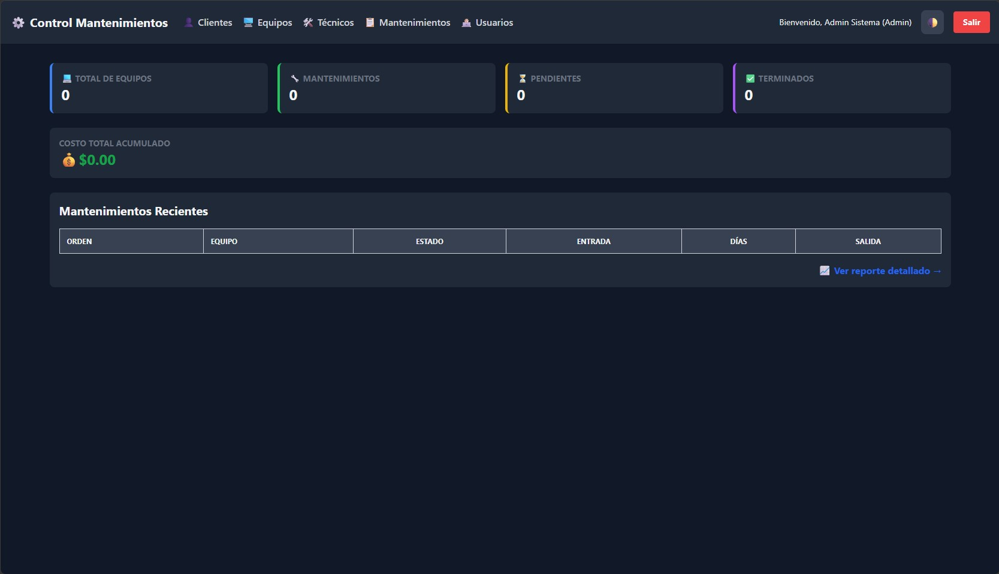

# Sistema de Control de Mantenimiento de Equipos



[](https://laravel.com)
[](https://php.net)
[](https://mysql.com)

Aplicación web para gestionar clientes, equipos, técnicos y órdenes de mantenimiento (preventivo/correctivo), con dashboard, reportes filtrables, exportación a Excel y PDF, y factura térmica en PDF.

---

## Tabla de contenidos

1. [Características](#-características-principales)
2. [Estructura del proyecto](#-estructura-del-proyecto)
3. [Seguridad y roles](#-seguridad-y-control-de-acceso)
4. [Variables de entorno relevantes](#-variables-de-entorno)
5. [Dashboard y reportes](#-dashboard-y-reportes)
6. [Requisitos](#-requisitos)
7. [Instalación](#-instalación)
8. [Credenciales de prueba](#-credenciales-de-prueba-seeders)
9. [Pruebas automatizadas](#-pruebas-automatizadas)
10. [Última verificación del proyecto](#-última-verificación-del-proyecto)
11. [Mejoras recientes (changelog)](#-mejoras-recientes-changelog)

---

## Características principales

- **Clientes y equipos**: alta, edición y baja (según rol); equipos vinculados a cliente y usuario que registró.
- **Técnicos**: ficha con datos de contacto y foto opcional.
- **Mantenimientos**: órdenes con número `ORD-n`, costo, fechas de entrada/salida, estado pendiente/terminado, factura PDF (formato ticket) y listado con filtros.
- **Dashboard**: tarjetas KPI (equipos, mantenimientos, pendientes, terminados), carrusel con gráficos (Chart.js): crecimiento 7 días, distribución de estados, **ingresos por día** (últimos 7 días según órdenes terminadas y fecha de salida), top técnicos; tarjetas de **costo acumulado** e **ingresos del día**; tabla de mantenimientos recientes; modo claro/oscuro con bordes de acento visibles en ambos temas.
- **Reportes** (`/reportes`): filtros por cliente, equipo, técnico, usuario, fechas, tipo, reparación, estado y rango de costo; **imprimir** con tabla y bordes uniformes; exportación **Excel** y **PDF**.
- **Usuarios** (solo administrador): CRUD, cambio de contraseña vía ruta dedicada, fotos en disco `public`.
- **Autenticación**: login con cuenta activa/inactiva; registro público con validación de contraseña fuerte.

---

## Estructura del proyecto

```
app/
  Console/Commands/SetupDatabase.php   # php artisan db:setup
  Exports/MantenimientosExport.php      # Excel de reportes
  Http/
    Controllers/                         # Auth, Dashboard, CRUDs, Mantenimiento (reportes, factura, PDF)
    Middleware/CheckRole.php, PreventBackHistory.php
  Models/                                # User, Cliente, Equipo, Tecnico, Mantenimiento
database/
  factories/, migrations/, seeders/
resources/views/
  auth/, clientes/, equipos/, mantenimientos/  # index, create, edit, reportes, pdf, factura
  tecnicos/, usuarios/, layouts/, dashboard.blade.php
routes/web.php
tests/                                   # Feature + Unit (ejemplo raíz → login)
```

Flujo principal de rutas: raíz → login; área autenticada con `auth` + prevención de historial hacia atrás; recurso `usuarios` bajo middleware `role:admin`.

---

## Seguridad y control de acceso

| Rol            | Alcance típico                                      |
|----------------|------------------------------------------------------|
| **admin**      | Todo; eliminaciones; módulo de usuarios.             |
| **tecnico**    | Crear y editar clientes, equipos, técnicos, órdenes. |
| **invitado**   | Solo lectura en la mayoría de módulos.              |

- Middleware **`role`** (`CheckRole`): comprueba rol y expulsa si el usuario fue desactivado (`active = false`).
- Varios controladores comprueban `Auth::user()->role` para crear/editar/eliminar.
- **Registro**: para asignar **administrador** o **técnico** hace falta la clave correspondiente (ver variables de entorno). Si la clave no coincide, el usuario se registra como **invitado**. El rol **invitado** no requiere clave de autorización.

---

## Variables de entorno

En `.env` (plantilla en `.env.example`):

| Variable | Uso |
|----------|-----|
| `ROLE_PROMOTE_ADMIN_SECRET` | Clave para registrar o promover rol **admin** (por defecto en código: `Admin2026*` si no defines la variable). |
| `ROLE_PROMOTE_TECNICO_SECRET` | Clave para registrar o promover rol **técnico** (por defecto: `Tecny2026*`). |

Puedes fijar tus propias claves en `.env` y conservar el archivo solo en el servidor (no subirlo al repositorio).

---

## Dashboard y reportes

- **Ingresos en dashboard**: el costo acumulado histórico considera mantenimientos **terminados** con **fecha de salida**; el gráfico “ingresos por día” agrupa por la misma fecha de salida en la ventana de 7 días.
- **Imprimir reportes** (`window.print`): la tabla usa la clase `reportes-tabla-imprimir`; en `@media print` se fuerza una cuadrícula estable (`border-collapse: separate`, bordes negros) para que todas las filas se vean igual; reglas extra para **tipo** (badge) y **columna equipo** (serial legible en impresión).
- **Reportes → listado de órdenes**: el enlace del número de orden apunta a `mantenimientos.index#mantenimiento-{id}`; en el listado, el script centra la fila y aplica `scroll-margin` respecto al menú fijo.
- **Vista de reportes**: el contenedor principal usa el mismo estilo de tarjeta que el resto del sistema (`bg-white/80`, `dark:bg-gray-800/80`, borde suave).
- **PDF de reporte** (`mantenimientos/pdf.blade.php`): diseño original de título y cuerpo; tabla con bordes más visibles y cabecera de columnas en gris neutro (`#525252`) en lugar del gris azulado anterior.

### Interfaz (Tailwind)

El layout principal (`layouts/app.blade.php`) carga **Tailwind CSS vía CDN** para estilos rápidos; el proyecto incluye `vite` y Tailwind en `package.json` por si compilas assets propios.

---

## Requisitos

- **PHP** 8.3 o superior (según `composer.json`).
- **Composer**, **Node.js** y **npm** (para Vite / assets).
- **MySQL/MariaDB** (o SQLite si ajustas `.env`).

---

## Instalación

1. **Clonar e instalar dependencias**

   ```bash
   git clone https://github.com/JohanVelez22/Control-Mantenimiento.git
   cd Control-Mantenimiento
   composer install
   npm install && npm run build
   ```

2. **Entorno**

   ```bash
   cp .env.example .env
   php artisan key:generate
   ```

   Configura `DB_*` en `.env` y, si aplicas, `ROLE_PROMOTE_ADMIN_SECRET` y `ROLE_PROMOTE_TECNICO_SECRET`.

3. **Base de datos y datos de demo**

   ```bash
   php artisan db:setup
   ```

   Equivale a asegurar la base (MySQL) o el archivo SQLite y ejecutar `migrate:fresh --seed`.

4. **Enlace de almacenamiento** (si usas fotos de usuarios o técnicos)

   ```bash
   php artisan storage:link
   ```

---

## Credenciales de prueba (seeders)

Tras `php artisan db:setup` (o `migrate:fresh --seed`):

- **Correo:** `admin@example.com`
- **Contraseña:** `Admin123*`

---

## Pruebas automatizadas

```bash
composer test
# o
php artisan test
```

Incluye una prueba de rutas que verifica que la raíz `/` redirige al invitado a la pantalla de login (comportamiento esperado de la aplicación).

---

## Última verificación del proyecto

*(Mayo 2026 — revisión automatizada y coherencia con el código actual.)*

| Comprobación | Resultado |
|--------------|------------|
| `php artisan test` | OK (2 tests: unitario de ejemplo + redirección `/` → login). |
| `php artisan route:list` | OK: rutas web registradas (dashboard, CRUDs, reportes, factura PDF, `usuarios.change-password`, etc.). |
| Migraciones | Comprobadas previamente en entorno local con `migrate:status` (según despliegue). |

**Limitaciones conocidas:** la suite de tests es mínima; no sustituye pruebas manuales en navegador (login, filtros de reportes, export Excel/PDF, permisos por rol). Conviene ampliar tests Feature cuando el flujo de negocio se estabilice.

---

## Mejoras recientes (changelog)

- **Dashboard**: KPI y tarjetas de ingresos con bordes claros en claro/oscuro; carrusel de 4 paneles (ingresos por día antes de top técnicos); flechas discretas. Se ha añadido la gráfica de **Ingresos Acumulados** junto a los **Ingresos del Día** en el carrusel de ingresos para comparar ambos valores visualmente (azul para ingresos diarios, verde para acumulados).
- **Reportes**: contenedor alineado al resto de vistas; impresión con clase `reportes-tabla-imprimir`; enlace de orden a listado con ancla y centrado de fila en `mantenimientos.index`.
- **PDF de reporte**: bordes reforzados; cabecera de columnas en gris neutro manteniendo el diseño original del documento.
- **Experiencia de Usuario (UX)**: Eliminación del cursor prohibido (`cursor-not-allowed`) en botones inhabilitados y zonas de solo lectura (facturas, mantenimientos, técnicos, equipos, clientes) para un diseño más limpio y menos restrictivo visualmente, manteniendo la seguridad de las acciones.
- **Registro / roles**: claves `ROLE_PROMOTE_ADMIN_SECRET` y `ROLE_PROMOTE_TECNICO_SECRET` (fallbacks documentados); sin `Control2026*`.
- **HTTP**: métodos `show` que redirigen a `edit` donde aplica; `UserController::changePassword` para `POST usuarios/{id}/change-password`.
- **Limpieza de Código**: Revisión integral para eliminar código innecesario, archivos inactivos y asegurar que todas las funcionalidades operen correctamente sin redundancias.
- **`.env.example`**: variables `ROLE_PROMOTE_*` documentadas.

---

*Desarrollado por Johan Velez y Santiago Zapata.*
