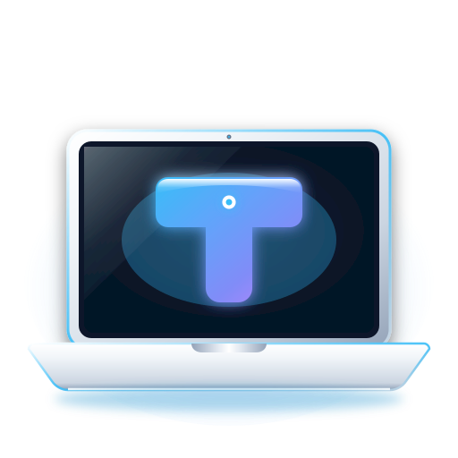

# 🛠️ TECNI SYSTEMAS - Sistema de Control de Mantenimiento, Taller e Integridad Financiera



[](https://laravel.com)
[](https://php.net)
[](https://mysql.com)
[](https://tailwindcss.com)
[-brightgreen?style=for-the-badge&logo=checkmarx)](tests)
[](app/Console/Commands/SystemAuditCommand.php)

Aplicación web empresarial de alto rendimiento diseñada para la gestión integral de talleres de servicio técnico, mantenimiento de equipos de cómputo, laboratorio de microelectrónica, inventario de repuestos con cálculo de utilidad, facturación POS, cotizaciones, control de caja chica y portal público de seguimiento para clientes.

---

## 📑 Tabla de Contenidos
1. [Características Principales](#-características-principales)
2. [Estructura del Proyecto y Base de Datos](#-estructura-del-proyecto-y-base-de-datos)
3. [Instalación Rápida con ServBay (Paso a Paso para Principiantes)](#-instalación-rápida-con-servbay)
4. [Credenciales de Acceso y Roles](#-credenciales-de-acceso-y-roles)
5. [Lógica Financiera y Manejo de Dinero Real](#-lógica-financiera-y-manejo-de-dinero-real)
6. [Auditoría y Pruebas Automatizadas](#-auditoría-y-pruebas-automatizadas)
7. [Documentación Adicional](#-documentación-adicional)

---

## 🌟 Características Principales

- **💻 Mantenimiento de Equipos**: Órdenes de trabajo preventivo y correctivo con consecutivo automático (`ORD-n`), diagnóstico, asociación de repuestos en tiempo real y facturación POS.
- **⚡ Laboratorio de Electrónica**: Reparación de tarjetas y microcomponentes (`ELC-n`), diagnóstico técnico, repuestos y abonos.
- **📦 Inventario y Repuestos**: Registro de productos con categorías, fotos, stock mínimo, margen de utilidad automatizado, precio al público y precio especial para técnicos.
- **💰 Caja Chica y Arqueo Diario**: Registro de ingresos y egresos, pagos en efectivo/consignación, abonos a órdenes, control de saldos y snapshot de cierre diario.
- **📄 Facturación POS y Cotizaciones**: Emisión de facturas térmicas PDF con desglose de repuestos y mano de obra. Cotizaciones con aprobación y conversión directa a factura.
- **👥 Clientes y Proveedores**: Directorio con autocompletado de Departamentos y Municipios colombianos (DANE) sin parpadeo.
- **🌐 Portal de Clientes / Invitados**: Consulta del estado de equipos por número de orden o identificación, con desglose claro de repuestos y servicio.
- **🎨 Interfaz Liquid Glass (Glassmorphism)**: Diseño premium translúcido, modales asíncronos interactivos (`ts-modal`) y modo oscuro/claro con detección automática.

---

## 🗄️ Estructura del Proyecto y Base de Datos

```
tecni-systemas/
├── app/
│   ├── Console/Commands/        # Auditoría profunda (SystemAuditCommand), Backups y Seeders
│   ├── Helpers/                 # ColombiaHelper (Formateo monetario y municipios DANE)
│   ├── Http/Controllers/        # Controladores CRUD, Caja, Auth, Reportes, Guest
│   ├── Models/                  # 19 Modelos Eloquent con relaciones fuertemente tipadas
│   ├── Services/                # StockService, AnulacionService, OrdenService
│   └── Traits/                  # Auditable, HandlesAbono, HandlesStockAttach
├── database/                    # Migraciones relacionales, seeders y factories
├── public/                      # Entry point, css/glass.css, favicon.svg
├── resources/views/             # Plantillas Blade con componentes Liquid Glass
├── routes/                      # web.php, console.php
└── tests/                       # Feature, Unit e Integration Tests
```

---

## 🚀 Instalación Rápida con ServBay

> Para una guía exhaustiva con capturas y explicaciones para usuarios sin experiencia, consulta [DOCUMENTACION_1_GUIA_INSTALACION_SERVBAY.md](DOCUMENTACION_1_GUIA_INSTALACION_SERVBAY.md).

### 1. Ubicar el proyecto
Coloca la carpeta del proyecto en la raíz de ServBay:
- **Windows:** `C:\ServBay\www\tecni-systemas`
- **macOS:** `/Applications/ServBay/db/www/tecni-systemas`

### 2. Configurar el Host en ServBay
- En el panel de **ServBay**, añade un nuevo Host con dominio `tecni-systemas.local`.
- Selecciona **PHP 8.3** o **8.4**.
- Configura el **Directorio Raíz** apuntando a: `C:\ServBay\www\tecni-systemas\public`.

### 3. Configurar `.env` e Instalar
Abre tu terminal en la carpeta del proyecto:
```bash
# 1. Copiar archivo de entorno
cp .env.example .env

# 2. Instalar dependencias backend y frontend
composer install
npm install && npm run build

# 3. Generar llave de seguridad
php artisan key:generate

# 4. Crear tablas y sembrar datos de prueba
php artisan migrate:fresh --seed

# 5. Crear enlace simbólico de imágenes
php artisan storage:link

# 6. Limpiar y optimizar caché
php artisan optimize:clear
```

---

## 🔑 Credenciales de Acceso y Roles

Ingresa en tu navegador a `http://tecni-systemas.local` o `http://localhost:8000`:

| Rol / Perfil | Correo Electrónico | Contraseña por Defecto | Alcance de Permisos |
| :--- | :--- | :--- | :--- |
| **👑 Administrador** | `administrador@tecnisystemas.com` | `Admin123*` | Control total del sistema, finanzas, caja chica, usuarios, auditoría y reportes. |
| **🛠️ Técnico** | `tecnico@tecnisystemas.com` | `Tecni123*` | Gestión de órdenes de mantenimiento, electrónica, abonos y consumo de repuestos. |
| **👁️ Invitado** | `invitado@tecnisystemas.com` | `Invit123*` | Portal público de consulta para clientes y seguimiento de estados. |

---

## ⚖️ Lógica Financiera y Manejo de Dinero Real

El sistema implementa reglas de precisión decimal y consistencia contable:
- **Precisión Monetaria**: Campos en `DECIMAL(12,2)` formateados con `ColombiaHelper`.
- **Atomicidad de Inventario**: Descuentos de stock con `lockForUpdate()`, impidiendo ventas sin existencias.
- **Cuadre de Facturas**: $\text{Saldo Pendiente} = \text{Total Factura} - \text{Total Pagado}$.
- **Seguridad en Anulaciones**: Anulación lógica (`anulado = true`) con reversión automática de stock y neutralización en caja chica sin pérdida de datos históricos.
- **Transacciones ACID**: Todas las operaciones complejas operan dentro de `DB::transaction()`.

---

## 🧪 Auditoría y Pruebas Automatizadas

El proyecto cuenta con una cobertura integral de pruebas automatizadas:

```bash
# Ejecutar todas las pruebas Unit y Feature (51 tests / 166 aserciones)
php artisan test

# Ejecutar pruebas de integración con base de datos real
./vendor/bin/phpunit -c phpunit-integration.xml

# Ejecutar la auditoría profunda del sistema (28 reglas de negocio críticas)
php artisan system:audit --deep

# Sembrar 5 registros realistas por cada módulo (Pruebas manuales)
php artisan app:seed-demo-data --force
```

---

## 📚 Documentación Adicional

En la raíz del proyecto se incluyen los siguientes manuales y cuadernos técnicos:
- 📖 [DOCUMENTACION_1_GUIA_INSTALACION_SERVBAY.md](DOCUMENTACION_1_GUIA_INSTALACION_SERVBAY.md) — Guía paso a paso desde cero para principiantes.
- 📘 [DOCUMENTACION_2_MANUAL_ARQUITECTURA_Y_NEGOCIO.md](DOCUMENTACION_2_MANUAL_ARQUITECTURA_Y_NEGOCIO.md) — Manual de arquitectura, diagramas relacionales y reglas financieras.
- 📊 [DOCUMENTACION_3_PRESENTACION_GRADO_Y_EMPRESA.md](DOCUMENTACION_3_PRESENTACION_GRADO_Y_EMPRESA.md) — Estructura de presentación y sustentación ejecutiva.
- 📜 [DOCUMENTACION_4_ACTA_ENTREGA_TERMINOS_LEGALES.md](DOCUMENTACION_4_ACTA_ENTREGA_TERMINOS_LEGALES.md) — Acta formal de entrega de software y garantía.
- 🤖 [DOCUMENTACION_PROYECTO_NOTEBOOKLM.md](DOCUMENTACION_PROYECTO_NOTEBOOKLM.md) — Base de conocimiento optimizada para Google NotebookLM.

---

*Desarrollado con arquitectura moderna, seguridad y rendimiento.*
